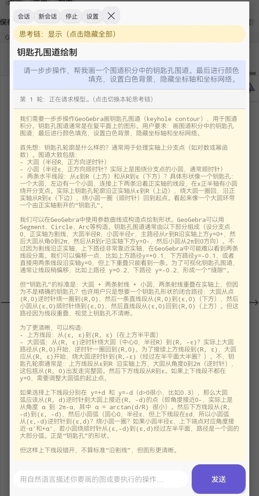
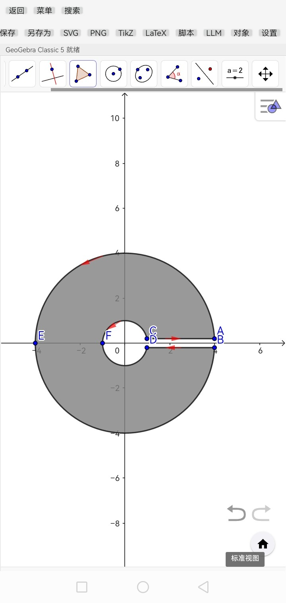
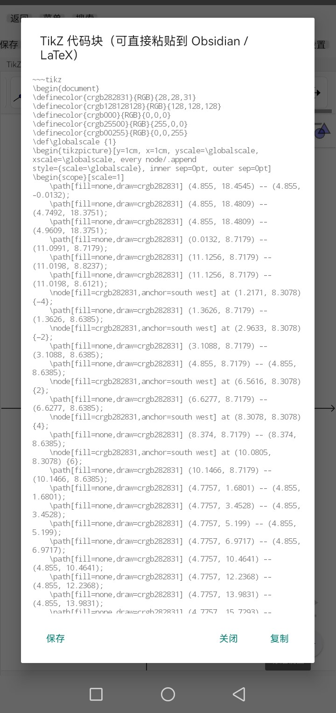

# GeoGebra Classic 5 for Android

一个把 **GeoGebra Classic 5** 完整移植到 Android 的离线应用，并加入了
**自然语言驱动绘图** 与 **SVG → TikZ 不失真导出** 能力。

## 核心特色

### 1. 自然语言驱动绘图（LLM 操作台）

内置可配置的 **LLM 操作台**，用自然语言描述你要画的图或要执行的操作，模型会：

- 逐轮生成 GeoGebra 命令（或页面内 JavaScript）并执行
- 每轮执行后回传完整作图快照（**全部对象**的颜色、填充、线型线宽、点型点大小、
  标签、图层、定义、值、坐标，以及坐标轴/网格/背景等视图状态）
- 支持流式输出，可实时查看思考链与回答
- 支持会话管理（新建/切换/重命名/删除，标题自动生成）
- 支持 OpenAI 兼容接口，默认配置为 DeepSeek，也可自行配置 API URL/Key/模型/
  请求头/请求体/温度/max_tokens/超时

示例：输入 *“请一步步操作，帮我画一个围道积分中的钥匙孔围道。最后进行颜色填充，
设置白色背景，隐藏坐标轴和坐标网络。”*，应用会自动创建圆弧、线段、填充并设置背景。



### 2. GeoGebra Classic 5 的 Android 移植版

- 内置 **完整的 GeoGebra Classic 5（web3d GWT）离线应用包**，不依赖网络即可使用
  代数区、绘图区、工具栏、菜单栏等完整功能
- 通过 `WebView.shouldInterceptRequest` 从 APK assets 提供
  `https://appassets.androidplatform.net/assets/*`，页面拥有真实 https origin，
  GWT 脚本、语言文件、deferredjs 分片均正常加载
- 顶栏提供：新建 / 打开 / 保存 / 另存为 / SVG / PNG / TikZ / LaTeX / 脚本 / LLM / 对象 / 设置
- 撤销/重做保留 GeoGebra 原始箭头图标，固定在右下角缩放按钮组上方
- 支持系统输入法（代数输入框、搜索框）
- 防误触：工具栏滑动不误点工具；绘图区轻点、拖拽、双指缩放按需转发
- 对象管理：清空全部对象、框选（原生选择工具）、多选勾选、批量删除/批量设置属性



### 3. 基于 SVG2TikZ 的 TikZ 不失真导出

- 复用 `obsidian-svg2tikz` 的 `SvgToTikzConverter`，把当前绘图导出为可直接粘贴到
  Obsidian / TikZJax 的 `~~~tikz` 代码块
- 支持 `codeblock` / `standalone` / `figonly` / `codeonly` 四种输出模式
- 可设置单位、缩放、小数位、箭头样式等导出选项



### 4. 其它特色

- **SVG / PNG / GGB 导出**：调用 GeoGebra 官方 JS API 导出当前绘图或保存作图文件
- **LaTeX 输入**：常见 LaTeX 公式自动翻译为 GeoGebra 命令
- **GGB / JS 脚本执行**：可逐行执行 GeoGebra 命令脚本或页面内 JavaScript
- **完整 LLM Skill 文档**：`SKILL.md` 描述所有桥接函数、GGB 脚本规范、
  填充/虚实/颜色命令、视图操作、智能体协议，便于接入任何 LLM
- **对象管理**：清空全部对象、框选、多选、批量删除、批量设置颜色/填充/线宽/点大小/标签
- **会话持久化**：LLM 对话本地保存，思考链支持全局/单轮显隐切换

---

## 目录结构

```
GeoGebraClassic5/
├─ app/
│  ├─ build.gradle.kts
│  ├─ proguard-rules.pro
│  └─ src/main/
│     ├─ AndroidManifest.xml
│     ├─ assets/
│     │  ├─ ggb.html              # GeoGebra Classic 5 宿主页 + JS 桥
│     │  ├─ deployggb.js          # GeoGebra 官方 applet 加载器
│     │  ├─ svg2tikz.js           # obsidian-svg2tikz 的 SvgToTikzConverter
│     │  ├─ SKILL.md              # LLM 操作说明书（系统提示词）
│     │  ├─ web3d/                # GeoGebra Classic 5 离线 web3d GWT 应用
│     │  └─ css/                  # 配套样式
│     ├─ java/com/ggb/classic5/
│     │  └─ MainActivity.java     # WebView 宿主、资源拦截、导出、LLM 操作台
│     └─ res/
│        ├─ layout/activity_main.xml
│        └─ values/strings.xml
├─ 示例图/                         # 应用截图
├─ SKILL.md                        # LLM Skill / 操作说明书
├─ build.gradle.kts
├─ settings.gradle.kts
├─ gradle.properties
└─ gradle/wrapper/...
```

---

## 构建与安装

### 要求

- JDK 17 或更高（本项目使用 JDK 21 构建通过）
- Android SDK：`compileSdk 34`、`build-tools 34.0.0`
- Android Gradle Plugin 8.5.2 / Gradle 8.7（仓库已含 wrapper）

### 构建

Windows：

```bat
set JAVA_HOME=<JDK 路径>
set ANDROID_HOME=<Android SDK 路径>
gradlew.bat assembleDebug
```

Linux / macOS：

```bash
export JAVA_HOME=<JDK 路径>
export ANDROID_HOME=<Android SDK 路径>
./gradlew assembleDebug
```

APK 输出：`app/build/outputs/apk/debug/app-debug.apk`

### 安装

```bash
adb install -r app/build/outputs/apk/debug/app-debug.apk
```

或直接把 APK 传到手机安装。

### 已有构建产物

仓库根目录提供已构建好的调试包：`GeoGebraClassic5-debug.apk`。

---

## 使用说明

### 顶栏按钮

| 按钮 | 功能 |
|------|------|
| 返回 | 从打开的搜索/材料页返回 |
| 菜单 | 打开 GeoGebra 菜单 |
| 搜索 | 打开 GeoGebra 搜索 |
| 新建 | 新建作图 |
| 打开 | 从系统文件选择器打开 `.ggb` 文件 |
| 保存 | 保存到当前已打开/已保存的 `.ggb`（无则走“另存为”） |
| 另存为 | 将当前作图另存为新的 `.ggb` 文件 |
| SVG | 将当前绘图导出为 SVG 文件 |
| PNG | 将当前绘图导出为 PNG 文件 |
| TikZ | 将当前绘图转换为 TikZ 代码块 |
| LaTeX | 输入常见 LaTeX 公式，转换为 GeoGebra 命令并执行 |
| 脚本 | 执行多行 GGB 命令脚本或页面内 JavaScript |
| LLM | 打开大模型操作台：自然语言驱动 GeoGebra |
| 对象 | 对象管理：清空/框选/多选/批量删除/批量属性 |
| 设置 | 界面语言、TikZ 输出模式/单位/缩放/小数位/箭头等 |

### LLM 配置（默认 DeepSeek）

设置对话框默认：

- API URL：`https://api.deepseek.com/chat/completions`
- 模型：`deepseek-v4-flash`
- `max_tokens`：`16000`（推理模型需要足够 token 输出最终 JSON）
- 思考长度限制：`0`（0 = 不追加“思考必须简短”约束；设为 80/100 等才追加）

也可以切换为任何 OpenAI 兼容接口。

### TikZ 默认输出格式

````markdown
~~~tikz
\begin{document}
...
\end{document}
~~~
````

### 脚本 / API 文档

完整桥接函数、GGB 脚本规范、填充/虚实命令、视图操作和 LLM 智能体协议见
[`SKILL.md`](SKILL.md)。

---

## 实现说明

- `MainActivity` 用 `shouldInterceptRequest` 拦截 `https://appassets.androidplatform.net/assets/*`，
  直接从 APK assets 提供 GeoGebra 应用文件，全程离线
- `ggb.html` 按 Classic 5 视图配置（代数区 + 绘图区）部署 `GGBApplet`
- `svg2tikz.js` 提取自 `obsidian-svg2tikz` 的 `SvgToTikzConverter`，在 WebView 内直接解析
  GeoGebra 返回的 SVG DOM 并生成 TikZ
- `__ggbGetSnapshot` 返回**全部对象**的完整属性和视图状态，作为 LLM 每轮反馈

---

## 许可证

- **本项目自身代码**：GPL-3.0（因包含 GPL-3.0 的 svg2tikz 代码），见 [`LICENSE`](LICENSE)
- **GeoGebra Classic 5 应用包**：版权归 GeoGebra GmbH，按 GeoGebra 官方许可使用
  （EUPL-1.2；整体软件包仅限非商业使用），见 <https://www.geogebra.org/license>
- **svg2tikz、obsidian-svg2tikz**：GPL-3.0
- 更多第三方组件说明见 [`THIRD_PARTY_LICENSES.md`](THIRD_PARTY_LICENSES.md)

> 请勿将本应用用于任何商业用途，除非你已另行取得 GeoGebra 官方的商业授权。
